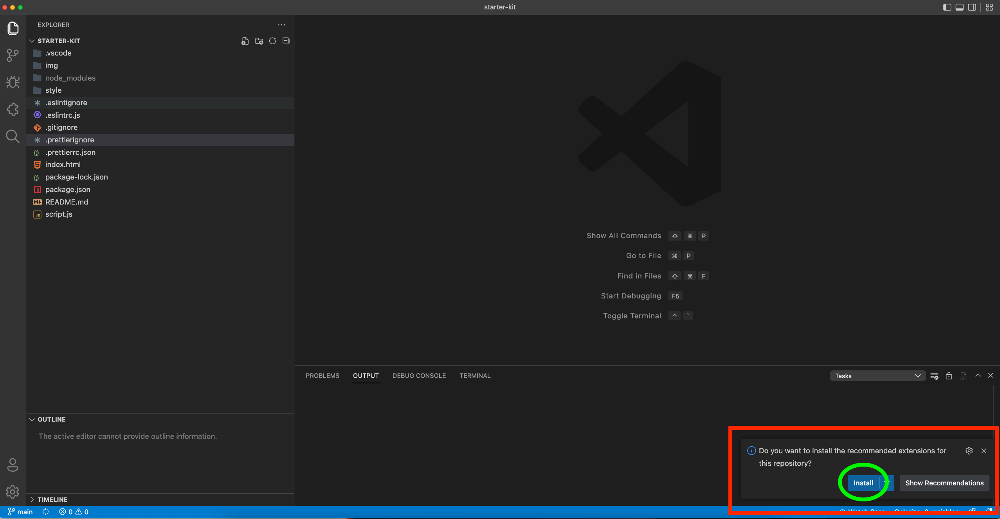

## :hammer_and_wrench: Project Starter Template :fire:

Save time by using this pre-made starter template for your new projects. Ideal for beginner learning, just enough to get you going fast, all pre-configured for you.

### Code Editor to use

You should use [VS Code](https://code.visualstudio.com) as your code editor.

### Tech configured for you :sparkles:

1. [Prettier](https://prettier.io)
2. [ESLint](https://eslint.org)
3. [SCSS](https://sass-lang.com)
4. VS Code 'formatOnSave' & other settings pre-configured for you. (.vscode/settings.json)
5. VS Code recommended extensions added for you. Just hit 'install' when asked.

### :cop: VS Code extensions

This starter project comes with recommended extensions pre-configured for you. A dialog box will appear asking you to install the "recommended extensions" the first time you use this starter project. Just hit yes, and you are all set to go!

If the recommended extension dialog box does not appear for you, you can always install the extensions manually.

1. [ESLint](https://marketplace.visualstudio.com/items?itemName=dbaeumer.vscode-eslint)
2. [Prettier](https://marketplace.visualstudio.com/items?itemName=esbenp.prettier-vscode)
3. [SASS Compiler](https://marketplace.visualstudio.com/items?itemName=glenn2223.live-sass)
4. [Live Server](https://marketplace.visualstudio.com/items?itemName=ritwickdey.LiveServer)

### :cop: use VS Code's formatOnSave feature

This starter projects comes with formatOnSave and other usefull settings pre-configured for you. You do not need to do anything else. You are welcome.

In case something does not work, [here is the manual setup guide](https://github.com/prettier/prettier-vscode)

### How to start / develop :nerd_face:

1. Click "Use this template" button.
2. Give the new repo a name.
3. Clone it to your machine.
4. In terminal, run 'npm install'. _Don't have npm installed?_
   - [Here's a guide to install Node / NVM](https://github.com/nvm-sh/nvm)
   - [Install NPM guide](https://docs.npmjs.com/downloading-and-installing-node-js-and-npm)
5. Click watch SASS button (you installed SASS Compiler plugin)
6. Right-click index.html file - select "Open with Live Server" option. (You installed Live Server extension)
7. Write code! :smiling_imp:

# Happy hacking & don't forget to say thanksssss! :raising_hand:
